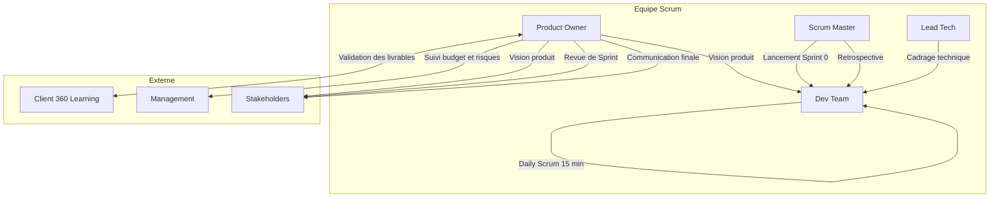
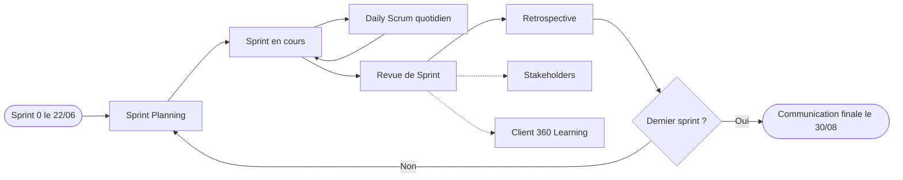
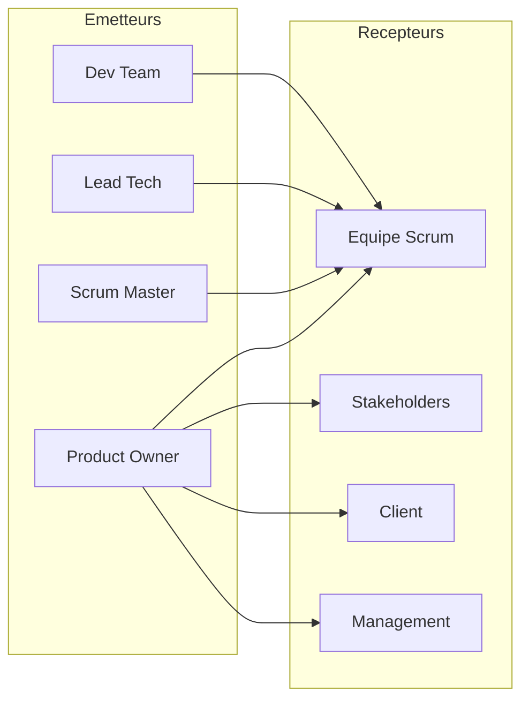

# Diagrammes de flux

Vue d'ensemble des échanges : qui parle à qui, et sur quel support. Même remarque que pour le diagramme de séquence : il faut un previewer compatible Mermaid (GitHub, GitLab, VS Code avec l'extension dédiée, ou https://mermaid.live).

## Flux global des communications

## Cycle de sprint

## Matrice émetteur / récepteur

On voit que le Product Owner concentre toutes les communications externes (client, management, stakeholders). Le Scrum Master, le Lead Tech et la Dev Team ne communiquent qu'en interne, c'est voulu : un seul point de contact vers l'extérieur évite les messages contradictoires.
