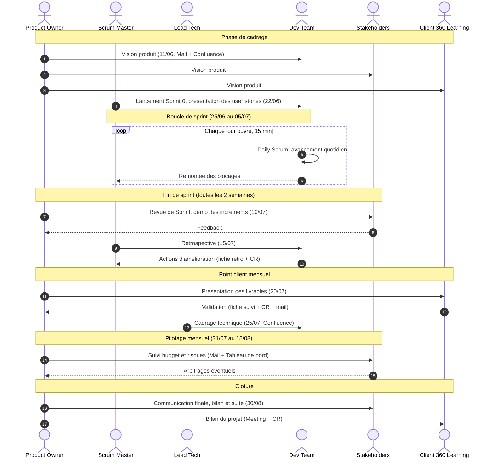
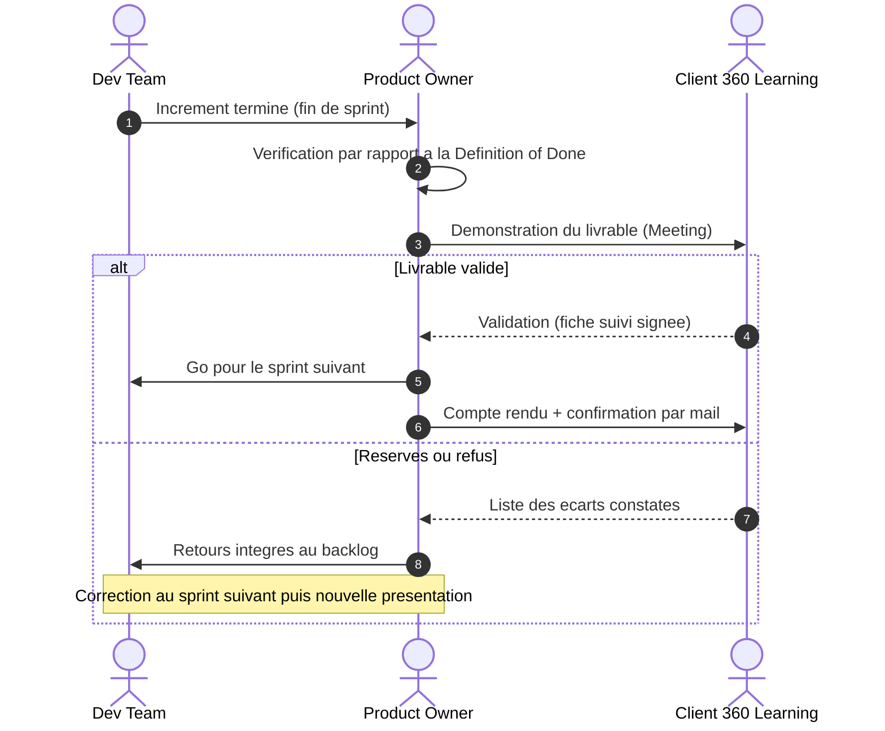

# Diagramme de séquence des communications

Ce diagramme montre l'enchaînement des communications du projet, du lancement (11/06) à la clôture (30/08).

Si le diagramme s'affiche en texte brut dans votre éditeur, il faut un previewer compatible Mermaid : sur VS Code, installer l'extension "Markdown Preview Mermaid Support". Sinon coller le bloc de code dans https://mermaid.live. GitHub et GitLab l'affichent nativement.

## Séquence globale du projet

## Zoom sur la validation client

## Lecture

- Flèche pleine (`->>`) : l'émetteur initie la communication.
- Flèche pointillée (`-->>`) : réponse ou retour.
- Le bloc `loop` correspond à une communication récurrente, le bloc `alt` à un embranchement (validé / refusé).

Remarque : les accents ont été retirés à l'intérieur des diagrammes pour éviter les soucis de rendu selon les versions de Mermaid.
