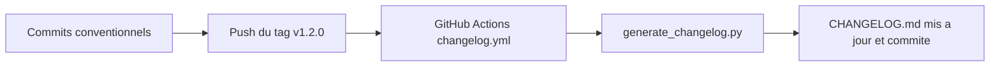

# Guide de contribution

Comment modifier cette documentation et alimenter le changelog au passage.

## Workflow

1. Créer une branche `docs/<sujet>` (par exemple `docs/maj-plan-sprint-2`).
2. Modifier les fichiers Markdown concernés.
3. Vérifier le rendu des diagrammes Mermaid (VS Code avec l'extension Markdown Preview Mermaid Support, ou https://mermaid.live).
4. Commiter au format Conventional Commits (voir plus bas, c'est ce qui alimente le changelog).
5. Ouvrir une merge request, relue par le Product Owner ou le Scrum Master.

## Convention de commits

Format : `<type>(<portée optionnelle>): <description>`

| Type | Usage | Section du changelog |
| --- | --- | --- |
| `feat` | Nouveau contenu (nouvelle section, nouveau document) | Nouveautés |
| `fix` | Correction (date erronée, lien cassé, faute) | Corrections |
| `docs` | Amélioration de documentation existante | Documentation |
| `chore` | Maintenance (scripts, config, renommages) | Maintenance |

Quelques exemples :

```
feat(plan): ajout de la communication de crise
fix(diagrammes): correction de la date de la revue de sprint
docs(readme): clarification de la structure du depot
chore(scripts): amelioration du script de changelog
```

## Génération du changelog

Le [CHANGELOG.md](../CHANGELOG.md) ne se modifie jamais à la main. Il est généré à partir de l'historique git par [scripts/generate_changelog.py](../scripts/generate_changelog.py) (Python 3.9+, aucune dépendance à installer).

En local :

```bash
# depuis la racine du depot
python scripts/generate_changelog.py

# avec une version explicite (cree une section datee)
python scripts/generate_changelog.py 1.2.0
```

Sous Windows, remplacer `python` par `py` si la commande n'est pas reconnue.

Ce que fait le script :

1. il lit `git log` depuis le dernier tag (ou tout l'historique s'il n'y a pas encore de tag) ;
2. il classe chaque commit selon son type Conventional Commits ;
3. il regroupe les entrées par section (Nouveautés, Corrections, Documentation, Maintenance) ;
4. il réécrit CHANGELOG.md en insérant la nouvelle version au-dessus des précédentes.

## Automatisation en CI

Le workflow [.github/workflows/changelog.yml](../.github/workflows/changelog.yml) régénère le changelog à chaque push d'un tag `v*` et commite le résultat. Publier une version se résume donc à :

```powershell
git tag v1.2.0
git push origin v1.2.0
```


