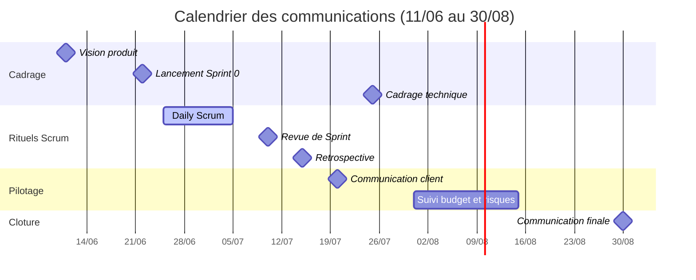

# Plan de communication détaillé

Document de référence du plan de communication du projet pour le client 360 Learning. Pour modifier ce document, voir [guide-contribution.md](guide-contribution.md).

## Tableau du plan d'action

| Objet de la communication | Date début | Récepteur | Message | Codage | Émetteur | Fréquence | Support |
| ------------------------- | -------------- | --------------------- | ------------------------------------ | -------------------- | ------------- | --------------- | ---------------------- |
| Vision produit | 11/06 | @all | Objectifs et périmètre du projet | Écrit | Product Owner | 1 fois | Mail + Confluence |
| Lancement Sprint 0 | 22/06 | Équipe Scrum | Présentation des user stories | Oral + PowerPoint | Scrum Master | 1 fois | Meeting |
| Daily Scrum | 25/06 -> 05/07 | Équipe Scrum | Avancement quotidien | Oral | Dev Team | Quotidien | Meeting (15 min) |
| Revue de Sprint | 10/07 | Équipe + Stakeholders | Démonstration des incréments | Oral + Démonstration | Product Owner | Bi-hebdomadaire | Meeting + CR |
| Rétrospective de Sprint | 15/07 | Équipe Scrum | Améliorations processus | Oral + Fiche rétro | Scrum Master | Bi-hebdomadaire | Meeting + CR |
| Communication client | 20/07 | Client (360 Learning) | Validation des livrables | Oral + Fiche suivi | Product Owner | Mensuel | Meeting + CR + Mail |
| Cadrage technique | 25/07 | Équipe Dev | Spécifications techniques | Oral + Documentation | Lead Tech | 1 fois | Meeting + Confluence |
| Suivi budget/risques | 31/07 -> 15/08 | Management | Rapport d'avancement | Écrit + Tableau | Product Owner | Mensuel | Mail + Tableau de bord |
| Communication finale | 30/08 | Équipe + Stakeholders | Bilan du projet et prochaines étapes | Oral + Présentation | Product Owner | 1 fois | Meeting + CR |

## Comment lire le tableau

- Date début : date de la première occurrence. Les communications récurrentes se répètent ensuite selon la fréquence indiquée.
- Codage : la forme du message (écrit, oral, support visuel).
- Support : le canal de diffusion. CR = compte rendu.
- Le détail des émetteurs et récepteurs est dans [parties-prenantes.md](parties-prenantes.md).

## Calendrier

## Règles de communication

1. Toute réunion avec CR au support donne lieu à un compte rendu publié sous 24 h sur Confluence.
2. Le Product Owner est le seul interlocuteur du client : pas de communication directe entre la Dev Team et le client.
3. Les communications récurrentes (daily, revue, rétro) sont posées dans les agendas dès le lancement du Sprint 0.
4. Le reporting management (budget/risques) part par mail avec un lien vers le tableau de bord à jour.
