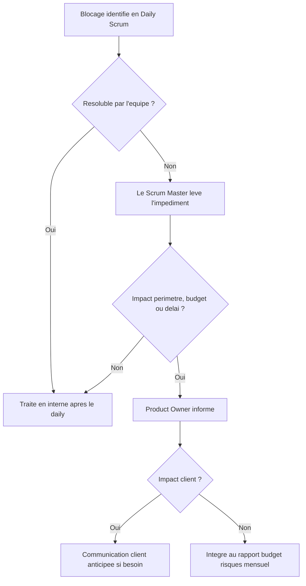

# Processus Scrum et rituels de communication

Description des rituels du projet et de leur lien avec le [plan de communication](plan-de-communication.md).

## Cadence

- Sprints de 2 semaines, d'où la fréquence bi-hebdomadaire des revues et rétrospectives.
- Sprint 0 lancé le 22/06 : préparation du backlog et présentation des user stories.
- Clôture le 30/08 avec la communication finale.

## Les rituels

### Vision produit (kick-off)

- Quand : 11/06, une seule fois.
- Qui : Product Owner vers tout le monde (@all).
- Contenu : objectifs, périmètre, critères de succès.
- Support : mail de lancement + page Confluence de référence (mise à jour si le périmètre bouge).

### Lancement Sprint 0

- Quand : 22/06.
- Qui : Scrum Master vers l'équipe Scrum.
- Contenu : présentation des user stories, organisation de l'équipe, outils.
- Support : meeting avec support PowerPoint.

### Daily Scrum

- Quand : tous les jours ouvrés, 15 minutes max, à heure fixe.
- Qui : la Dev Team (le Scrum Master facilite, le PO peut assister).
- Contenu : les trois questions classiques, fait hier / prévu aujourd'hui / blocages.
- Règle importante : les blocages se traitent après le daily, pas pendant.

### Revue de Sprint

- Quand : en fin de chaque sprint, la première le 10/07.
- Qui : le Product Owner anime, devant l'équipe et les stakeholders.
- Contenu : démonstration des incréments terminés, recueil du feedback.
- Livrable : compte rendu publié sous 24 h.

### Rétrospective de Sprint

- Quand : après chaque revue, la première le 15/07.
- Qui : le Scrum Master anime, équipe Scrum uniquement (cadre de confiance, pas de stakeholders).
- Contenu : ce qui a marché, ce qui doit s'améliorer, actions concrètes.
- Livrable : fiche rétro + compte rendu, actions suivies au sprint suivant.

### Communication client

- Quand : mensuelle, la première le 20/07.
- Qui : Product Owner et client 360 Learning.
- Contenu : présentation et validation formelle des livrables.
- Livrable : fiche de suivi signée + CR + confirmation par mail.

### Cadrage technique

- Quand : 25/07, une seule fois (puis complété au fil de l'eau sur Confluence).
- Qui : Lead Tech vers l'équipe Dev.
- Contenu : architecture, choix techniques, conventions, spécifications.

### Suivi budget / risques

- Quand : mensuel, campagne du 31/07 au 15/08.
- Qui : Product Owner vers le management.
- Contenu : avancement, consommation budgétaire, risques et plans de mitigation.
- Support : mail + tableau de bord à jour.

### Communication finale

- Quand : 30/08.
- Qui : Product Owner vers l'équipe et les stakeholders.
- Contenu : bilan du projet (réussites, enseignements) et prochaines étapes.

## Escalade des blocages

